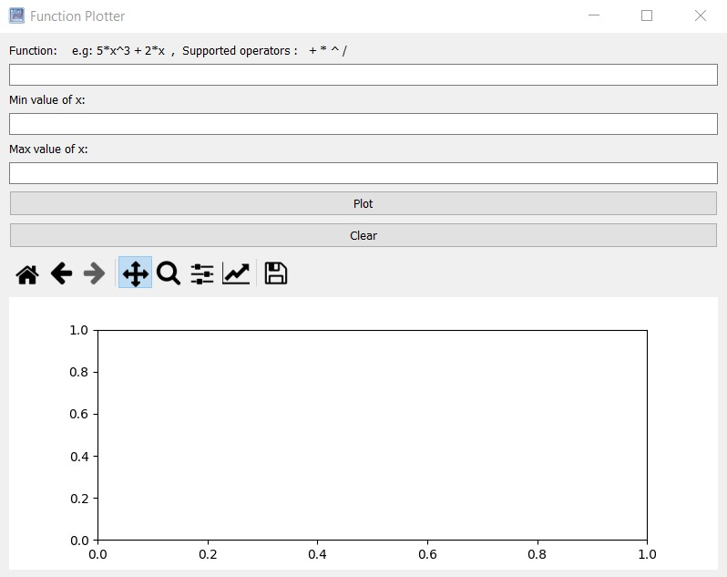
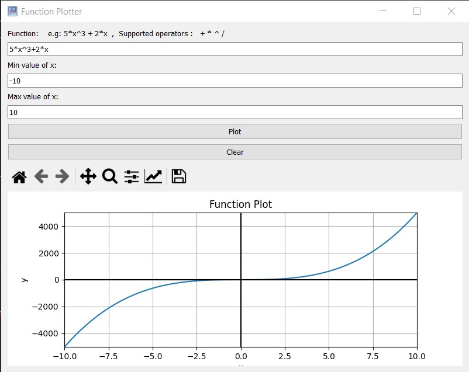
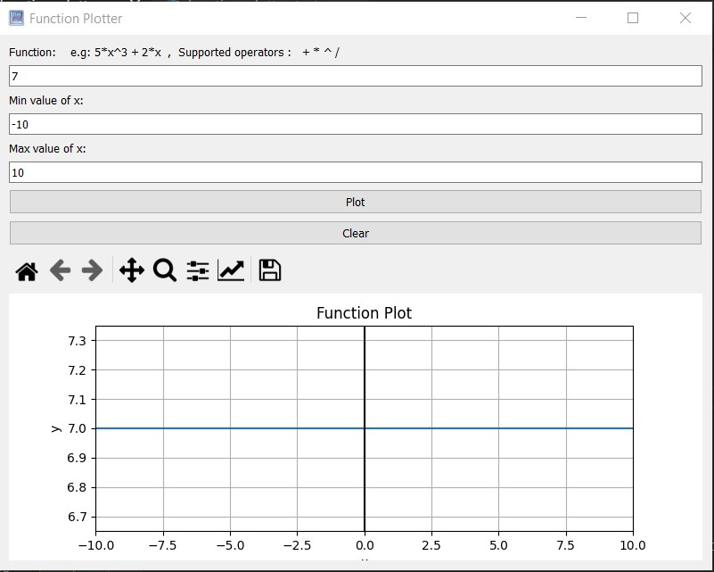
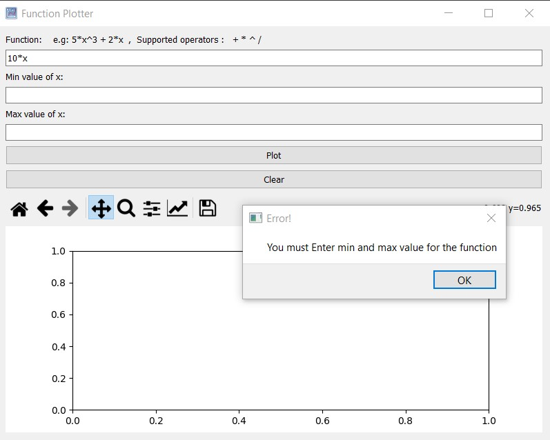
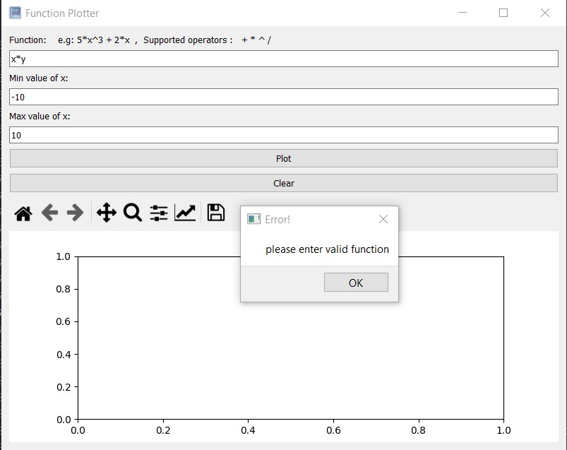
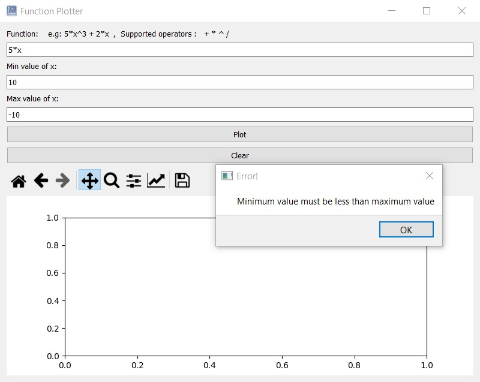

# Function-Plotter
Function plotter GUI using python with pyside2 and pytest to plot an arbitrary user-entered function.

## Screenshots

### Start

### Valid Function

### Constant Function

### Errors

